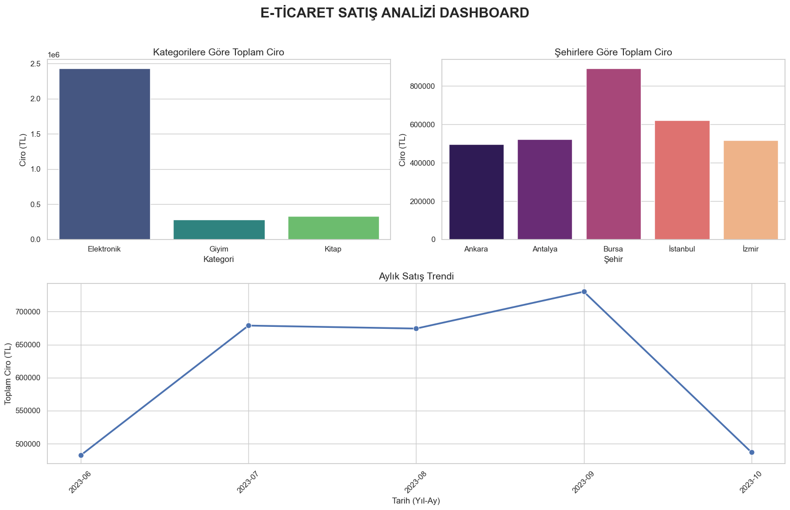

# 📊 İlişkisel Veritabanı ve İş Zekası (BI) Projesi

Bu proje, karmaşık veri yapılarının **İlişkisel Veritabanı** mantığıyla (Primary Key / Foreign Key) modellenmesi, `JOIN` işlemleriyle birleştirilmesi ve görselleştirilerek bir **İş Zekası (Dashboard)** raporu haline getirilmesi süreçlerini içermektedir.

## 🛠️ Kullanılan Teknolojiler
* **Python:** Pandas (Veri manipülasyonu ve JOIN işlemleri)
* **Görselleştirme:** Seaborn, Matplotlib (Mini Dashboard tasarımı)
* **Veritabanı Mantığı:** Relational Database Design, SQL (INNER JOIN)

## 📝 Proje Adımları

1. **İlişkisel Tabloların Oluşturulması:** Müşteriler, Ürünler ve Siparişler olmak üzere 3 farklı tablo oluşturulmuştur. Siparişler tablosu, diğer tablolara `Musteri_ID` ve `Urun_ID` (Foreign Key) üzerinden bağlanmıştır.
2. **Verilerin Birleştirilmesi (JOIN):** Parçalı haldeki bu tablolar, analize uygun hale getirilmek için `INNER JOIN` mantığı ile tek bir veri seti (`Dashboard_Verisi.csv`) haline getirilmiştir. *(Projedeki SQL klasöründe bu işlemin MS SQL karşılığı da bulunmaktadır).*
3. **Dashboard ve Raporlama:** Birleştirilen veri üzerinden kategorik ciro dağılımları, bölgesel satış performansları ve aylık satış trendlerini gösteren bir İş Zekası gösterge paneli (Dashboard) Python ile çizdirilmiştir.

## 📈 Dashboard Çıktısı

